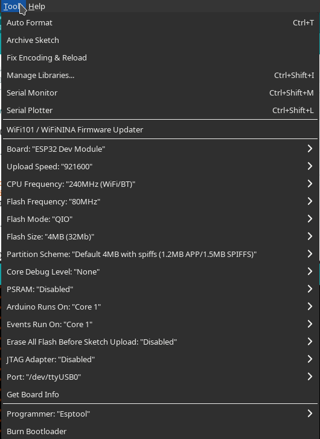
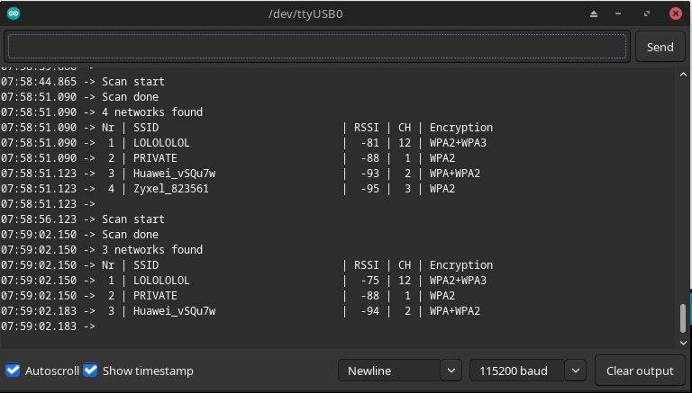

# ESP32 AccessPoint WebServer

This is an example on creating a simple webserver for the ESP32 with the CP2102 chip.

---

The appropriate arduino IDE settings for the board are shown in the image below:

The first sketch I tried was the Example > WiFi > WiFiScan. Serial output shown below:

To pass files on the ESP32 an additional tool is needed. This tool can be found [here](https://github.com/me-no-dev/arduino-esp32fs-plugin).

## Sources:

* https://randomnerdtutorials.com/installing-the-esp32-board-in-arduino-ide-mac-and-linux-instructions/
* https://randomnerdtutorials.com/esp32-access-point-ap-web-server/
* https://randomnerdtutorials.com/install-esp32-filesystem-uploader-arduino-ide/
* https://randomnerdtutorials.com/display-images-esp32-esp8266-web-server/
* https://forum.arduino.cc/t/espasyncwebserver-h-no-such-file-or-directory-error-even-after-installing-espasyncwebsrv-library/1145099
